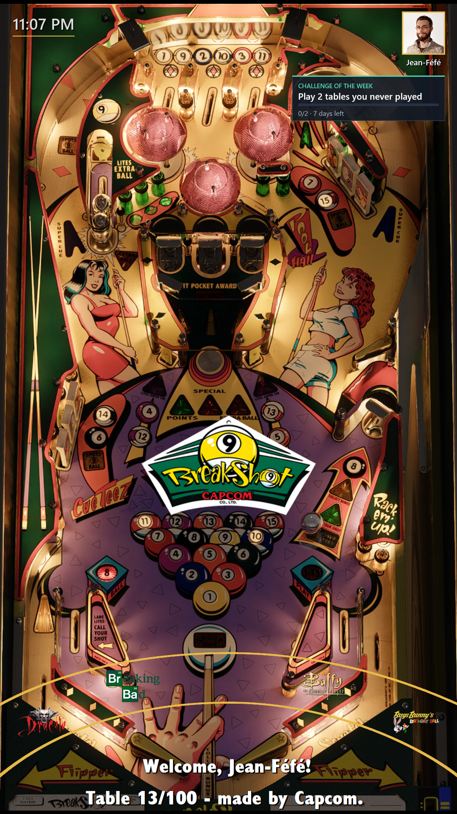
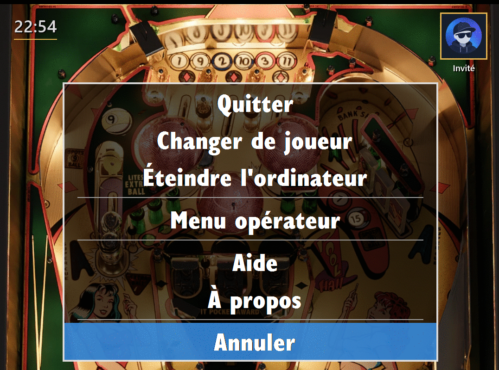
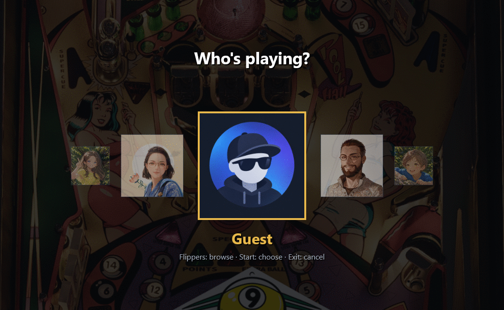
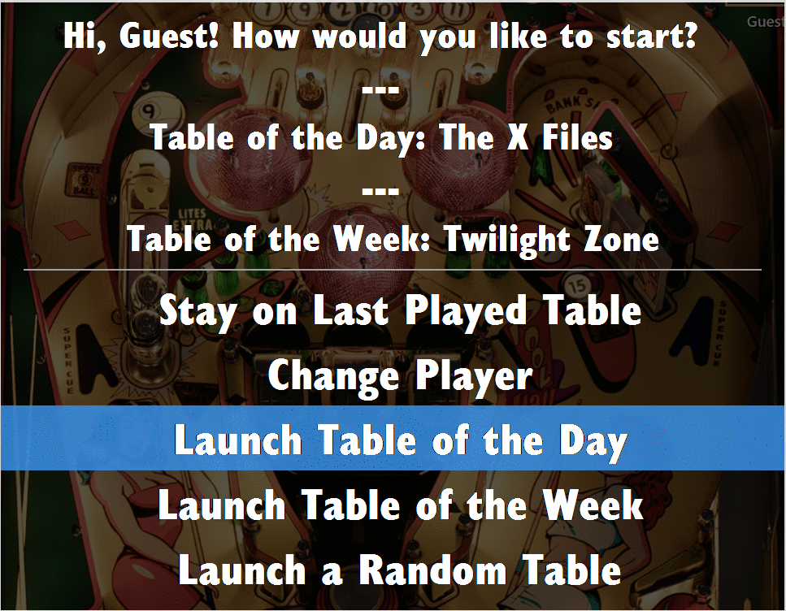
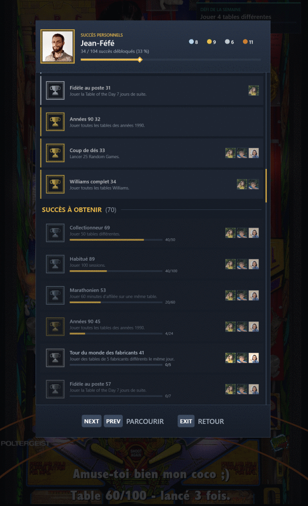

# PinballY Expansion Pack

Extension non officielle de [PinballY](http://mjrnet.org/pinscape/PinballY.php), écrite avec l'API de scripting JavaScript que PinballY ouvre à tous les développeurs. · *[English version](README.md)*

> **Votre pincab, en français, avec de vraies raisons d'y revenir.** Profils avec avatar, table du jour, défis hebdomadaires, succès Bronze à Platine : tout ce qui manquait à PinballY, sans toucher à PinballY. Et ce n'est que le début…



### PinballY en 6 langues



Les menus et messages de PinballY enfin en français, mais aussi en allemand, espagnol, italien et portugais.

### Un Profil pour chacun



Avec « Changer de joueur », chacun prend son Profil et son Avatar, avec ses propres Succès et Statistiques.

### Table du jour, table de la semaine



Chaque jour une table jamais jouée ou oubliée, chaque semaine une table au hasard, proposées dès le démarrage.

### Défis de la semaine


Chaque lundi, un nouveau Défi : sa carte suit votre progression sur l'écran de la roue.

### Succès



Des dizaines de Succès, du Bronze au Platine, annoncés sans interrompre vos parties et réunis dans « Succès personnels ».

**Et aussi** : table au hasard sur une roue de la fortune, filtres « Tables les plus jouées » et « Tables Originales », horloge, ligne d'état, rappel pour noter une table, lancement sans flash noir, backglass masqué pendant une partie, sons de lancement et de succès.

## Installation

Nécessite **Windows** et **PinballY 1.1.0 Beta 10** ou plus récent (plus la fonctionnalité facultative *Lecteur Windows Media*, pour les sons de lancement et de succès uniquement).

1. **Sauvegardez** `PinballY\Scripts`, en particulier `main.js` : ce projet le remplace.
2. **Copiez le projet** dans `PinballY\Scripts`, en gardant votre dossier `System`.
3. **Copiez `.env.example` en `.env.local`** et réglez ce qu'il vous faut, un `CLÉ=valeur` par ligne (UTF-8). Les réglages absents gardent leur valeur par défaut ; `.env.local` est ignoré par git.
4. **Redémarrez PinballY** et consultez `PinballY.log` : il liste vos réglages, une ligne « initialized » par add-on, et des lignes `ERROR` qui désignent l'add-on en cause.

## Réglages

```
LANGUAGE=fr
ACHIEVEMENT_TOAST_SECONDS=4
```

`LANGUAGE` choisit la langue (`en`, `fr`, `de`, `es`, `it` ou `pt`) et `ACHIEVEMENT_TOAST_SECONDS` le nombre de secondes pendant lesquelles un Succès reste affiché. Chaque fonctionnalité se désactive avec sa clé `ADD_ON_*`, par exemple `ADD_ON_CLOCK=false`. Tous les réglages sont décrits dans [.env.example](.env.example).

La progression de chaque Profil est enregistrée dans le dossier `profiles`, que les mises à jour du projet n'écrasent jamais : gardez-le pour la retrouver après une réinstallation.

### Profil admin

Pour garder les entrées de configuration pour vous seul, ajoutez `"isAdmin": true` au premier niveau du `profiles\<nom>\profile.json` de votre Profil, PinballY fermé. Dès qu'au moins un Profil est marqué, les autres Profils (Invité compris) ne voient plus « Configuration de la table » dans le menu principal ni « Menu opérateur » dans le menu de sortie ; les Profils admin voient toujours les deux, et le bouton de service de la porte monnayeur ouvre toujours le Menu opérateur pour tout le monde. Plusieurs Profils peuvent être marqués. Invité n'est jamais un Profil admin, et une marque qui n'est ni `true` ni `false`, ou dont la clé est mal écrite (`"isAdmin "`, `"IsAdmin"`), est ignorée et signalée dans `PinballY.log`.

### Profil enfant

Pour tenir les tables pour adultes à l'écart d'un enfant, donnez-leur dans PinballY la catégorie `NSFW` (ou nommez votre propre catégorie avec `ADULT_CATEGORY` dans `.env.local`, écrite exactement comme dans PinballY), puis ajoutez `"isChild": true` au premier niveau du `profiles\<nom>\profile.json` de l'enfant, PinballY fermé. Tant que ce Profil est actif, ces tables n'apparaissent sur la roue sous aucun filtre, la partie aléatoire n'en tire jamais et le démarrage ne laisse jamais la roue sur l'une d'elles ; passer à un autre Profil les fait revenir aussitôt. Invité n'est jamais un Profil enfant : les adultes de passage voient toute la collection. Ce n'est pas un contrôle parental : rien ne demande de mot de passe.

### Nettoyage des menus

Menu Cleanup allège les menus de PinballY pour tous les Profils, Profils admin compris : il retire Aide et À propos du menu de sortie, et Informations, Flyer, Meilleurs scores et Carte d'instructions du menu principal (Noter la table et Ajouter aux favoris restent). C'est la seule fonctionnalité **désactivée par défaut** : activez-la avec `ADD_ON_MENU_CLEANUP=true`. Les boutons dédiés de PinballY pour ces écrans, si vous les avez affectés, fonctionnent toujours.

## Contribuer

Organisation du code, conventions, tests, ajout d'une langue et remise à zéro de la progression : voir le [guide du contributeur](CONTRIBUTING.md) (en anglais).

## Licence

MIT. Voir [LICENSE](LICENSE).
